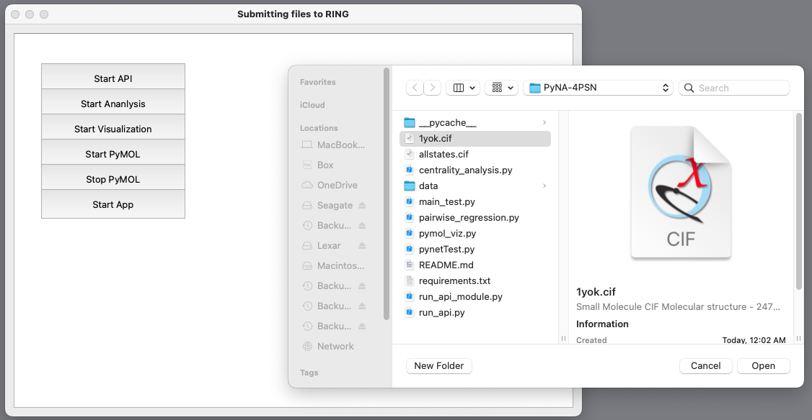
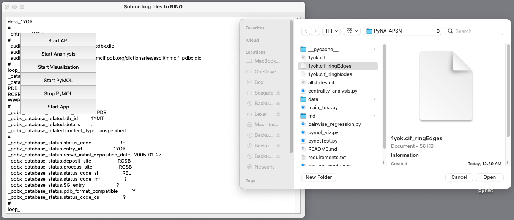
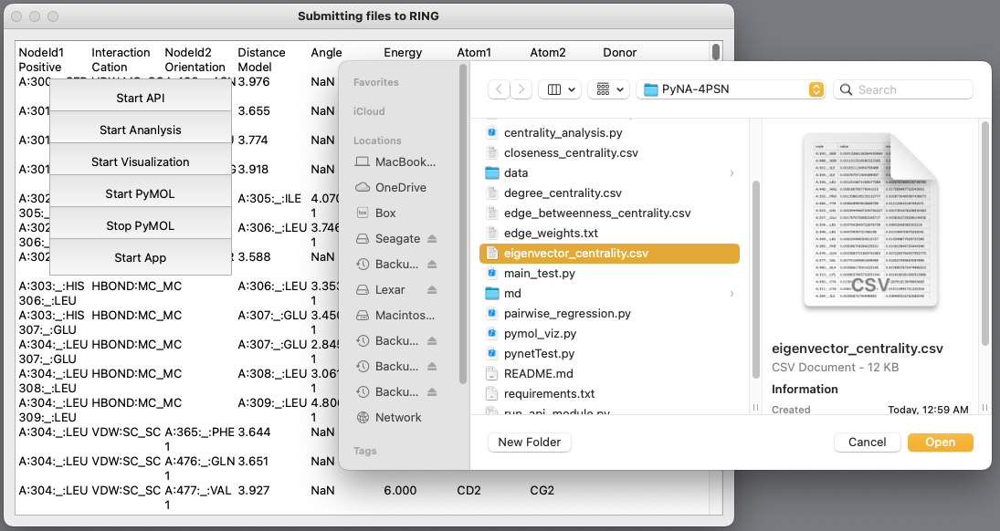

# PyNA-4PSN
A PyMOL plugin for protein structure network analysis and visualization in PyMOL.

## 1) Copy and paste the following code into a terminal and return. This will clone the PyNA-4PSN repo to the local directory of the user's choice:

```bash
git clone https://github.com/LastCodeBender42/PyNA-4PSN.git
```

## 2) cd into the directory PyNA-4PSN and run execute the requirements.txt file to install the necessary the dependnecies:

```bash
pip install -r requirements.txt
```

## 3) Start the program by running:

```bash
python main_test.py
```

## 4) The following Gui will appear. Select "Start API" and navigate to the .cif file of interest and select "Open". In this example, we select 1yok.cif:



### NOTE: Once the API is started, it connects with the RING server and submits the .cif file and after a few moments the protein strutcure network is retrieved. It will be a file with a .cif_ringEdges ending.

## 5) After the API has finished running, perform the network analysis. From the GUI, select "Start Analysis" and select the .cif_ringEdges file:



### NOTE: This analysis automatically performs four analyses of network centrality: Betweenness, Closeness, Degree, and Eigenvector. It also performs one analysis of edge betweenness centrality. This measure is used to automatically resize the edges of the network. The edges are drawn between the Calpha atoms of the protein structure. The node centrality recolors residues based on the normalized centrality values selected by the user.

## 6) Create the PSN visualization. From the GUI select, "Start Visualization" and for the purposes of demonstrating the tool select "eigenvector_centrality.csv":



### NOTE: This will create a **pynetTest.py** file which is loaded into PyMOL in order to create the PSN visualization.
